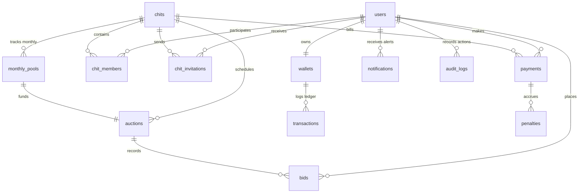

# 🛠 DEV_CONTEXT.md

## Technical & Logic Architecture Context – Smart Chit Fund System

This document provides a comprehensive blueprint of the Smart Chit Fund Management System. It explains the core architectural flow, database relationships, exact financial mathematical logic, background automations, and a page-by-page breakdown of how the frontend and backend are connected.

---

# 🌐 1. SYSTEM ARCHITECTURE & CONNECTION FLOW

The platform is designed around a decoupled client-server architecture with state persistence in a MySQL database:

```
[React Frontend] (Vite)
       │
   (Axios) Requests containing JWT in Authorization header
       ▼
[Express.js Server] ──(Auth Middleware)── Enforces Token Validation & Role Checks
       │
  (Controllers) Executes business logic and database queries
       ├─────────────────────────────────┐
       ▼                                 ▼
[MySQL Database]                  [node-cron Service]
State persistence & ACID         Scheduled daily tasks for dues, 
transactions via mysql2 pool      penalties, and report generations
```

### Authentication & Authorization Logic
* **JWT Token**: Created at user login. Signed using a server-side `JWT_SECRET` key. Contains user metadata (`id` and `role`). Enforced on all protected routes via `authMiddleware.js`.
* **Vite API Proxy**: In development, Vite is configured with a dev-server proxy targeting `http://localhost:5000/api` for all `/api/*` frontend calls, avoiding CORS issues.
* **Role-Based Access Control (RBAC)**: Controllers utilize `requireRole("ADMIN")` or `requireRole("MEMBER")` to restrict endpoints (e.g., only admins can create chits, send invitations, start auctions, or close auctions).

---

# 🗄️ 2. DATABASE SCHEMA & WIRING RELATIONSHIPS

The platform's database model enforces financial auditability using 14 interconnected tables:



### Table wiring descriptions:
* **users & wallets**: A 1-to-1 relationship. Wallet records are automatically created during user registration.
* **chits & chit_members**: A 1-to-many relationship. Enforces a capacity limit (`chits.total_members`).
* **payments & monthly_pools**: Monthly installment payments by members are grouped per month (`payments.installment_number`). The system runs an aggregate check on total collected amounts for each installment inside the `monthly_pools` table.
* **monthly_pools & auctions**: An auction is attached to a specific locked pool (`pool_id`). The auction payout is safe and depends directly on the funds collected in that monthly pool.
* **auctions & bids**: Members submit bidding bids tied to an active auction. Bids determine the winner and dividend distributions.
* **wallets & transactions**: Financial ledger containing double-entry transactions (DEPOSIT, WITHDRAWAL, INSTALLMENT_PAYMENT, AUCTION_WINNING, DIVIDEND, COMMISSION, etc.) pointing to the wallet.

---

# 📐 3. FINANCIAL LOGIC & MATHEMATICAL FORMULAS

The system operates on a **Cash-flow-safe pool model**. Unlike traditional chits that payout the entire baseline value regardless of collection, this system ensures payouts are backed by actual money collected in the pool.

### A. Monthly Installments & Duration
* **Monthly Installment Amount**:
  $$\text{monthly\_installment} = \text{round}\left(\frac{\text{chit\_value}}{\text{duration\_months}}\right)$$

### B. Late Fee Calculation
* Calculated when a member pays their monthly installment. If the payment date is past the `due_date` (plus `grace_period_days` check):
  $$\text{late\_fee} = \text{round}(\text{monthly\_installment} \times \text{late\_fee\_rate})$$
  $$\text{total\_payable} = \text{monthly\_installment} + \text{late\_fee}$$
* The system inserts a record in `penalties` (`penalty_type = 'LATE_FEE'`) and logs the payment status as `LATE_PAYMENT`.

### C. Cash-flow-safe Auction Calculation (`calculateCashflowAuctionPreview`)
When an auction is started or simulated, the system aggregates the total collected pool amount and distributes it safely:
1. **Admin Commission**:
   $$\text{admin\_commission\_amount} = \text{round}(\text{pool\_amount} \times \text{admin\_commission\_rate})$$
2. **Reserve Fund (Initial)**:
   $$\text{reserve\_amount} = \text{round}(\text{pool\_amount} \times \text{reserve\_rate})$$
3. **Discount Amount**: The discount offered by the winning bidder (bid percentage):
   $$\text{discount\_amount} = \text{round}(\text{pool\_amount} \times \frac{\text{discount\_percent}}{100})$$
4. **Winner Payout**:
   $$\text{winner\_payout} = \text{round}(\text{pool\_amount} - \text{admin\_commission\_amount} - \text{reserve\_amount} - \text{discount\_amount})$$
5. **Dividend per Member**: Divided equally among all members who **paid** this month's installment (excluding the winning member):
   $$\text{eligible\_dividend\_members} = \text{paid\_member\_count} - 1$$
   $$\text{dividend\_per\_member} = \text{floor}\left(\frac{\text{discount\_amount}}{\text{eligible\_dividend\_members}}\right)$$
6. **Undistributed Reserve / Rounding Spill**: Since dividends are floored to avoid fractional payouts exceeding collected amounts, the remainder is funneled back into the reserve:
   $$\text{undistributed\_spill} = \text{discount\_amount} - (\text{dividend\_per\_member} \times \text{eligible\_dividend\_members})$$
   $$\text{final\_reserve\_amount} = \text{reserve\_amount} + \text{undistributed\_spill}$$

### D. Payout Deductions & Debt Settlement
Before crediting the winner's wallet with the payout, the system automatically checks for dues:
* **Total Deductions** = Overdue installments from previous months + Next month's pre-billed installment (if configured).
* **Net Payout Credited** = $\max(0, \text{winner\_payout} - \text{total\_deductions})$.
* **Remaining Debt** = $\max(0, \text{total\_deductions} - \text{winner\_payout})$.

### E. User Merit Score
To enforce trust, a global rating score (0 to 100) is tracked for every user:
* **On-time payment**: $+2$ points.
* **Late payment**: $-5$ points.
* **Skipping monthly installment completely (Grace period expiry)**: $-10$ points.

---

# ⏰ 4. BACKGROUND TASK AUTOMATION (CRON SERVICE)

The backend service runs a daily background cron scheduler (`cronService.js`) scheduled for **8:00 AM** (`0 8 * * *`):

```
       [8:00 AM Cron Trigger]
                 │
      ┌──────────┼──────────┐
      ▼          ▼          ▼
[Reminders]  [Penalties] [Reports]
```

1. **Daily Dues Reminders (`sendPaymentReminders`)**:
   * Evaluates all active chits.
   * Compares the current date with the calculated installment due date.
   * Sends notifications if the due date is in **7 days, 3 days, 1 day, or 0 days**.
2. **Late penalty audits (`checkAndApplyLatePenalties`)**:
   * Evaluates all active chits.
   * If today's day of month is exactly `due_day + grace_period_days + 1`, identify members whose membership status is `DEFAULTER` (have unpaid dues).
   * Automatically deducts **10 points** from their user `merit_score`.
3. **Monthly report compiler (`generateMonthlyReports`)**:
   * Runs only on the **1st of the month**.
   * Pulls the previous month's completed `monthly_pools` records.
   * Inserts or updates summary statistics in `monthly_reports` (total collected, total pending, paid members count, unpaid members count).

---

# 📄 5. FRONTEND PAGE-BY-PAGE LOGIC & CONNECTIVITY

Every page communicates with Express API routes using modular helper files located in `new_react/src/api/`. Below is the complete logical wiring for each page.

---

## 🔑 Login (`Login.jsx`)
* **Purpose**: User login screen.
* **Operations**:
  1. Clears existing storage: `localStorage.removeItem("token")`, `role`, and `user` on mount.
  2. Input: `phone`, `password`.
  3. Action: Calls `loginUser({ phone, password })` from `authApi.js`.
  4. Returns: JWT `token`, `role`, and `user_id`.
  5. Storage: Saves `token`, `role`, and `user` object in `localStorage`.
  6. Routing: Redirects to `/admin` if role is `ADMIN`, otherwise to `/member`.
* **Path Map**: `/` $\rightarrow$ `/admin` or `/member`.

---

## 📝 Register (`Register.jsx`)
* **Purpose**: Create a new account.
* **Operations**:
  1. Input: `name`, `phone`, `email`, `password`, `role` (ADMIN or MEMBER).
  2. Action: Calls `registerUser(form)` from `authApi.js`.
  3. Backend logic: Hashes password, registers user, and initializes an empty `wallet` with a `0.00` balance.
  4. Routing: Navigates to `/` (Login) on success.
* **Path Map**: `/register` $\rightarrow$ `/`.

---

## 👑 Admin Dashboard (`AdminDashboard.jsx`)
* **Purpose**: Primary control panel for administrators.
* **Loaded data**: Calls `getAdminDashboard()` on load.
* **Displayed elements**:
  * **Totals panel**: Active group counts, total joined users, system defaulters.
  * **Financial stats**: Summed commission earnings, reserve fund value, total collection pool amounts, and admin wallet balance.
  * **Chit Groups grid**: List of chits showing member counts and statuses. Clicking a group navigates to `/chits/:chitId`.
  * **Open Auctions list**: Pending auctions. Clicking starts a closing calculator.
  * **Defaulters grid**: Unpaid members ordered by unpaid streak. Contains a button to send a manual payment reminder.
* **Interactive actions**:
  * **KYC Review Panel**: Lists members with pending verification. Approve/Reject actions update the database user status.
  * **Create Chit button**: Opens `/create-chit` form.
* **Path Map**: `/admin` $\rightarrow$ `/create-chit` or `/chits/:chitId` or `/monthly-reports`.

---

## 👤 Member Dashboard (`MemberDashboard.jsx`)
* **Purpose**: Primary control panel for contributors.
* **Loaded data**: Calls `getMemberDashboard()` on load.
* **Displayed elements**:
  * **Totals panel**: Joined chits count, pending dues, total late fees, merit score indicator.
  * **My Groups list**: Grid of active chits the user participates in. Shows status, current installment progress, and pending/cleared indicators.
  * **Pending invitations**: Lists chit groups they have been invited to. Buttons to **Accept** (which runs KYC check and calls `acceptInvitation(invitationId)`) or **Reject**.
  * **Live Auctions**: Active auctions in their groups, linking to `/auctions`.
  * **Notifications**: List of system alerts (reminders, winning payouts, dividends).
* **Interactive actions**:
  * **Submit KYC Button**: Opens the `KYCModal.jsx` if their account status is `PENDING`.
* **Path Map**: `/member` $\rightarrow$ `/chits/:chitId` or `/wallet` or `/payments` or `/auctions`.

---

## 📈 Create Chit (`CreateChit.jsx`)
* **Purpose**: Group initialization form.
* **Operations**:
  1. Input: `group_name`, `chit_value`, `duration_months`, `total_members`, `minimum_members_required`, `minimum_collection_required`, `reserve_rate`, `monthly_due_date`, `grace_period_days`, `description`.
  2. Action: Calls `createChit(formData)` from `chitApi.js`.
  3. Calculations (Frontend check): Displays calculated installment (`value / duration`) and warns if collection limits are set incorrectly.
  4. Routing: Redirects back to `/admin` on successful creation.
* **Path Map**: `/create-chit` $\rightarrow$ `/admin`.

---

## 🔍 Chit Details Page (`ChitDetailsPage.jsx`)
* **Purpose**: Comprehensive view of a specific chit group.
* **Loaded data**: Calls `getChitDetails(chitId)` from `chitApi.js`.
* **Displayed elements**:
  * **Group Details Card**: Value, duration, rates, and active pool.
  * **Members Table**: Displays all joined users, their unpaid streaks, and auction status.
  * **Installments/Payment Logs Grid**: Comprehensive list of payments made for each month.
  * **Auction History Table**: Completed auctions with winners and winning discount percentages.
  * **Monthly Pool Statuses**: Lists monthly collection statuses (`COLLECTING`, `READY`, `LOCKED`, `SETTLED`).
* **Interactive actions**:
  * **Send Invitation form (Admin only)**: Input member's phone number. Calls `inviteMember(chitId, phone)` to issue a pending invitation.
  * **Bidding Panel (Member only)**: Quick link to the active auction.
* **Path Map**: `/chits/:chitId` $\rightarrow$ `/auctions` or `/payments` (via dashboard/navigation links).

---

## 🔨 Live Auction Page (`AuctionPage.jsx`)
* **Purpose**: Bidding panel and auction closing console.
* **Loaded data**: Calls `getAuctionDetails(auctionId)` from `auctionApi.js` and fetches live bids.
* **Displayed elements**:
  * **Live Auction Panel**: Shows installment number, pool amount, base amount, and timer.
  * **Bids Ledger**: List of bids received. Admins see all bids; members see only their own bids.
  * **Live Bidding Input (Member only)**: Bidding input for discount % (e.g. 10%). Calculates dynamic estimated payout and dividends on the fly.
* **Interactive actions**:
  * **Submit Bid (Member only)**: Calls `placeBid(auctionId, { discount_percent })`. Validates if the user has paid their installment for this month, hasn't won previously, and isn't a defaulter.
  * **Start Auction (Admin only)**: Pre-check if pool meets minimum criteria, calls `startAuction({ chit_id, installment_number })` to open bidding.
  * **Close Auction / Calculate Result (Admin only)**: Calls `calculateAuctionResult(auctionId)`. Closes the auction, processes ledger payouts, distributes dividends to other paid members, deposits admin commission, and transfers rounding spill to reserve.
* **Path Map**: `/auctions` $\rightarrow$ `/chits/:chitId`.

---

## 💳 Payment Page (`PaymentPage.jsx`)
* **Purpose**: Installment clearance panel.
* **Loaded data**: Calls `getPaymentStatus(chitId)` from `paymentApi.js`.
* **Displayed elements**:
  * **Dues Card**: Displays current installment, due date, monthly installment amount, and calculated late fee.
  * **History Grid**: Lists all previous payments made by this user in the chit group.
  * **Collections status (Admin view)**: Displays two lists: members who have paid the current month and members who are unpaid. Button to trigger a manual reminder.
* **Interactive actions**:
  * **Pay Installment (Member only)**: Calls `makePayment({ chit_id, installment_number, payment_date })`. Debits their virtual wallet, records the payment, logs transaction details, updates their `merit_score`, and updates the monthly pool collection status.
* **Path Map**: `/payments` $\rightarrow$ `/member` or `/admin`.

---

## 💼 Wallet Page (`WalletPage.jsx`)
* **Purpose**: Virtual money management panel.
* **Loaded data**: Calls `getWalletDetails()` from `walletApi.js`.
* **Displayed elements**:
  * **Wallet Card**: Current balance.
  * **Ledger Entries**: Detailed list of transactions (Deposits, installment debits, dividend additions, payouts).
* **Interactive actions**:
  * **Deposit Funds**: Form to deposit money. Calls `addFunds({ amount, description })`.
  * **Withdraw Payout**: Form to withdraw money (credits ledger balance, updates wallet).
* **Path Map**: `/wallet` $\rightarrow$ `/member`.

---

## 📊 Monthly Report Page (`MonthlyReport.jsx`)
* **Purpose**: Auditing logs for administrators.
* **Loaded data**: Calls `getMonthlyReports()` from `dashboardApi.js`.
* **Displayed elements**:
  * Consolidated table showing history of monthly pool collections: collected amount, pending collections, paid count, unpaid count, and report date.
* **Path Map**: `/monthly-reports` $\rightarrow$ `/admin`.

---

## 📄 Protected Route Component (`ProtectedRoute.jsx`)
* **Purpose**: Route guard.
* **Logic**:
  1. Checks if `token` exists in `localStorage`. Redirects to `/` if missing.
  2. If an `allowedRole` is specified, decodes the token or checks `localStorage.role`.
  3. If user's role does not match `allowedRole` (e.g. member attempting to access `/admin`), redirects them to their respective dashboard (`/member` or `/admin`).
  4. Renders child component on success.

---

# 🔗 6. CORE LOGIC WRITTEN END-TO-END

```
      [Member accept invitation]
                  │
          (KYC Check OK?)
                  │
        (Creates Membership)
                  │
      [Month starts: pool generated]
                  │
      [Member makes installment payment]
                  │
         (Deducts from Wallet)
         (Accrues to Monthly Pool)
         (Updates member status to PAID)
                  │
      [Minimum collections met?]
                  │
          [Admin starts Auction]
         (Locks Monthly Pool state)
                  │
      [Members submit discount bids]
                  │
        [Admin completes Auction]
                  │
    ┌─────────────┼─────────────┐
    ▼             ▼             ▼
[Winner Paid] [Admin Fee] [Dividends]
Net payout     Commission  Distributed
to wallet      to wallet   to paid members
    │
[Pool state set to SETTLED]
```
